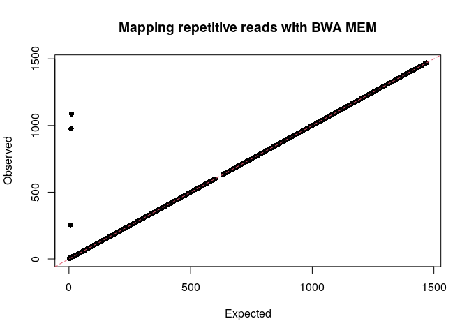

BWA MEM usage.

    bwa mem || true

    ## 
    ## Usage: bwa mem [options] <idxbase> <in1.fq> [in2.fq]
    ## 
    ## Algorithm options:
    ## 
    ##        -t INT        number of threads [1]
    ##        -k INT        minimum seed length [19]
    ##        -w INT        band width for banded alignment [100]
    ##        -d INT        off-diagonal X-dropoff [100]
    ##        -r FLOAT      look for internal seeds inside a seed longer than {-k} * FLOAT [1.5]
    ##        -y INT        seed occurrence for the 3rd round seeding [20]
    ##        -c INT        skip seeds with more than INT occurrences [500]
    ##        -D FLOAT      drop chains shorter than FLOAT fraction of the longest overlapping chain [0.50]
    ##        -W INT        discard a chain if seeded bases shorter than INT [0]
    ##        -m INT        perform at most INT rounds of mate rescues for each read [50]
    ##        -S            skip mate rescue
    ##        -P            skip pairing; mate rescue performed unless -S also in use
    ## 
    ## Scoring options:
    ## 
    ##        -A INT        score for a sequence match, which scales options -TdBOELU unless overridden [1]
    ##        -B INT        penalty for a mismatch [4]
    ##        -O INT[,INT]  gap open penalties for deletions and insertions [6,6]
    ##        -E INT[,INT]  gap extension penalty; a gap of size k cost '{-O} + {-E}*k' [1,1]
    ##        -L INT[,INT]  penalty for 5'- and 3'-end clipping [5,5]
    ##        -U INT        penalty for an unpaired read pair [17]
    ## 
    ##        -x STR        read type. Setting -x changes multiple parameters unless overridden [null]
    ##                      pacbio: -k17 -W40 -r10 -A1 -B1 -O1 -E1 -L0  (PacBio reads to ref)
    ##                      ont2d: -k14 -W20 -r10 -A1 -B1 -O1 -E1 -L0  (Oxford Nanopore 2D-reads to ref)
    ##                      intractg: -B9 -O16 -L5  (intra-species contigs to ref)
    ## 
    ## Input/output options:
    ## 
    ##        -p            smart pairing (ignoring in2.fq)
    ##        -R STR        read group header line such as '@RG\tID:foo\tSM:bar' [null]
    ##        -H STR/FILE   insert STR to header if it starts with @; or insert lines in FILE [null]
    ##        -o FILE       sam file to output results to [stdout]
    ##        -j            treat ALT contigs as part of the primary assembly (i.e. ignore <idxbase>.alt file)
    ##        -5            for split alignment, take the alignment with the smallest coordinate as primary
    ##        -q            don't modify mapQ of supplementary alignments
    ##        -K INT        process INT input bases in each batch regardless of nThreads (for reproducibility) []
    ## 
    ##        -v INT        verbosity level: 1=error, 2=warning, 3=message, 4+=debugging [3]
    ##        -T INT        minimum score to output [30]
    ##        -h INT[,INT]  if there are <INT hits with score >80% of the max score, output all in XA [5,200]
    ##        -a            output all alignments for SE or unpaired PE
    ##        -C            append FASTA/FASTQ comment to SAM output
    ##        -V            output the reference FASTA header in the XR tag
    ##        -Y            use soft clipping for supplementary alignments
    ##        -M            mark shorter split hits as secondary
    ## 
    ##        -I FLOAT[,FLOAT[,INT[,INT]]]
    ##                      specify the mean, standard deviation (10% of the mean if absent), max
    ##                      (4 sigma from the mean if absent) and min of the insert size distribution.
    ##                      FR orientation only. [inferred]
    ## 
    ## Note: Please read the man page for detailed description of the command line and options.

Generate 100 unique reads with read lengths of 100 bp and repeat each
unique read incrementally, i.e. first read is unique, second read is
repeated twice, third read is repeated thrice, and so on. Next use these
reads to generate a reference sequence where each read is separated by a
spacer sequence that is five times the length of a read, which is 500 bp
in this case.

The reference sequence is indexed and the reads mapped to this reference
using the default BWA settings.

    l=100
    r=100
    ../script/create_ref_se.pl -l ${l} -r ${r}
    bwa index l${l}_r${r}_ref.fa 2> /dev/null
    bwa mem l${l}_r${r}_ref.fa l${l}_r${r}_reads.fa 2> /dev/null > default.sam

    ## FASTA reads written to l100_r100_reads.fa
    ## FASTA reference written to l100_r100_ref.fa
    ## Done

The default for reporting for multimappers

> -h INT\[,INT\] if there are <INT hits with score >80% of the max
> score, output all in XA \[5,200\]

Read `6`, which occurs six times in the reference has all five
additional mapping loci reported in the XA tag and reads mapping seven
times or more do not have additional loci reported.

In addition, note that the reported location, i.e. columns three and
four of the SAM file, is not the first occurrence of the sequence. You
can confirm this by looking at the XA tag and seeing that there are
coordinates smaller than the reported location.

    head default.sam

    ## @SQ  SN:ref  LN:1515200
    ## @PG  ID:bwa  PN:bwa  VN:0.7.17-r1188 CL:bwa mem l100_r100_ref.fa l100_r100_reads.fa
    ## 1    0   ref 201 60  100M    *   0   0   ATATGTCCGAGGAATGCTACGCGTTGTTTACCAGCTAATCCCGATGCCAAGGGAAACCCGAAGTTAGGGCAGAGGCAACAAACGACACTAGCTTGACATG    *   NM:i:0  MD:Z:100    AS:i:100    XS:i:0
    ## 2    0   ref 501 0   100M    *   0   0   TTTAACCCGCGATACGGTATCGGATTTACGTACGGGTCACCTGATACAGAAGCGTAGCATTTATACACCGGGCGGAATTGATTGCCTAACGACCAGCGCT    *   NM:i:0  MD:Z:100    AS:i:100    XS:i:100    XA:Z:ref,+801,100M,0;
    ## 3    0   ref 1701    0   100M    *   0   0   CCGAGGCCCACATGACCTCGTGAACTCTAAGAGGGCTTCTTAAGTAGGCTGCTCGGGGACTTAGACCAATACCCGTGGGAGATCGATTTGCGCGAATTAC    *   NM:i:0  MD:Z:100    AS:i:100    XS:i:100    XA:Z:ref,+1101,100M,0;ref,+1401,100M,0;
    ## 4    0   ref 2901    0   100M    *   0   0   AGCACTCGTTTCAACCAGAATCGACCAACTAGTGACATCCGGGTTAGCTGTTTCAGCAGATACGAGGCCCGACCTAAACGAAAATTGATGGCTTCTTCTA    *   NM:i:0  MD:Z:100    AS:i:100    XS:i:100    XA:Z:ref,+2301,100M,0;ref,+2601,100M,0;ref,+2001,100M,0;
    ## 5    0   ref 3801    0   100M    *   0   0   AACTCGGTCAGGTTCGCTAGCGCACAGTGCAGTGAAGGACATGGTCAGGAAGGATGCCGTGTTGCTATAGCCTCAATACAACACAACAGAGGTGATAACT    *   NM:i:0  MD:Z:100    AS:i:100    XS:i:100    XA:Z:ref,+3201,100M,0;ref,+4401,100M,0;ref,+3501,100M,0;ref,+4101,100M,0;
    ## 6    0   ref 5901    0   100M    *   0   0   GCGTAGGGGAAGCTTCTGTGTCGCATCACAGTTGCGTTTGCTAGTGCGATGAGACTAGCGGTCCCCAATATGCCTGTATGCGAGCCAGTAACTTCCCATG    *   NM:i:0  MD:Z:100    AS:i:100    XS:i:100    XA:Z:ref,+5001,100M,0;ref,+5601,100M,0;ref,+4701,100M,0;ref,+6201,100M,0;ref,+5301,100M,0;
    ## 7    0   ref 7401    0   100M    *   0   0   ATTACGCTTCGCGTTTACATTGACCCAGAGCTGTTTTACCCAGAGTAGCTGTGGGTCACATGGATATCGTTGTTTGTTACTCGGCTACGCCGCTGTGTAC    *   NM:i:0  MD:Z:100    AS:i:100    XS:i:100
    ## 8    0   ref 9201    0   100M    *   0   0   GAGGGAAATGGTATCCCCATCATGGTTGGTTTTGAGAGTGGATCACAGCTAATTAAAAAAGACATCGAGGCTCAGTTTCGATAGTAGTAGGTGGCCTAGG    *   NM:i:0  MD:Z:100    AS:i:100    XS:i:100

We will repeat the mapping step 100 times to test whether reported loci
are randomly selected. We have also set `-h` to 20 to report up to 20
additional loci, to provide more loci to (potentially) randomly select
from.

However, the reported mapping of read `20` is always the same, so even
though the reported loci seems to be randomly selected, the same loci is
chosen.

    l=100
    r=100
    for i in {1..100}; do
       bwa mem -h 20 l${l}_r${r}_ref.fa l${l}_r${r}_reads.fa 2> /dev/null
    done | grep ^20 | sort | uniq -c

    ##     100 20   0   ref 62301   0   100M    *   0   0   TACTGCCACAGCGCCAGTATGTCTGTTTCGTGAGAAAGTACTTTTTGCTTCCCTAAGACGTTGAAGCAGGCAGGTGAGTTGTAGCCACAGTCCATATGCT    *   NM:i:0  MD:Z:100    AS:i:100    XS:i:100    XA:Z:ref,+57801,100M,0;ref,+57201,100M,0;ref,+61701,100M,0;ref,+59901,100M,0;ref,+59601,100M,0;ref,+61401,100M,0;ref,+58101,100M,0;ref,+58401,100M,0;ref,+60201,100M,0;ref,+59301,100M,0;ref,+61101,100M,0;ref,+62001,100M,0;ref,+59001,100M,0;ref,+60501,100M,0;ref,+62601,100M,0;ref,+58701,100M,0;ref,+60801,100M,0;ref,+57501,100M,0;ref,+62901,100M,0;

We will generate a read that repeats up to 505 times. The `-c` parameter
will skip regions that occur 500 times by default and thus a read will
have up to 500 additional loci reported, which is what the Perl
one-liner is showing.

> -c INT skip seeds with more than INT occurrences \[500\]

    l=100
    r=505
    ../script/create_ref_se.pl -l ${l} -r ${r}
    bwa index l${l}_r${r}_ref.fa 2> /dev/null
    bwa mem -h ${r} l${l}_r${r}_ref.fa l${l}_r${r}_reads.fa 2> /dev/null > r${r}.sam

    cat r${r}.sam | cut -f1,16 | perl -lane '@c = $_ =~ /ref/g; print $F[0], "\t", scalar @c + 1' | tail

    ## FASTA reads written to l100_r505_reads.fa
    ## FASTA reference written to l100_r505_ref.fa
    ## Done
    ## 496  496
    ## 497  497
    ## 498  498
    ## 499  499
    ## 500  500
    ## 501  500
    ## 502  500
    ## 503  500
    ## 504  500
    ## 505  500

We will generate a read that repeats up to 600 times and set `-c` and
`-h` to 600. The results show that reads now show more than 500
additional loci.

    l=100
    r=600
    ../script/create_ref_se.pl -l ${l} -r ${r}
    bwa index l${l}_r${r}_ref.fa 2> /dev/null
    bwa mem -h ${r} -c ${r} l${l}_r${r}_ref.fa l${l}_r${r}_reads.fa 2> /dev/null > r${r}.sam

    cat r${r}.sam | cut -f1,16 | perl -lane '@c = $_ =~ /ref/g; print $F[0], "\t", scalar @c + 1' | tail

    ## FASTA reads written to l100_r600_reads.fa
    ## FASTA reference written to l100_r600_ref.fa
    ## Done
    ## 591  591
    ## 592  592
    ## 593  593
    ## 594  594
    ## 595  595
    ## 596  596
    ## 597  597
    ## 598  598
    ## 599  599
    ## 600  600

BWA MEM works for 3,500 additional loci but fails for 4,000.

    l=100
    r=3500
    ../script/create_ref_se.pl -l ${l} -r ${r}
    bwa index l${l}_r${r}_ref.fa 2> /dev/null
    bwa mem -h ${r} -c ${r} l${l}_r${r}_ref.fa l${l}_r${r}_reads.fa 2> /dev/null > r${r}.sam

    cat r${r}.sam | cut -f1,16 | perl -lane '@c = $_ =~ /ref/g; print $F[0], "\t", scalar @c + 1' | tail

    ## FASTA reads written to l100_r3500_reads.fa
    ## FASTA reference written to l100_r3500_ref.fa
    ## Done
    ## 3491 3491
    ## 3492 3492
    ## 3493 3493
    ## 3494 3494
    ## 3495 3495
    ## 3496 3496
    ## 3497 3497
    ## 3498 3498
    ## 3499 3499
    ## 3500 3500

Mapping repetitive reads to chromosome X, retaining up to 1500
additional loci.

    r=1500
    gunzip -c ../data/chrX.fa.gz > chrX.fa
    bwa index chrX.fa 2> /dev/null
    bwa mem -h ${r} -c ${r} chrX.fa ../data/chrx_kmer.fa.gz 2> /dev/null > chrx.sam

Save mapping profile to `chrx.tsv`.

    cat chrx.sam \
       | grep -v "^@" \
       | cut -f1,16 \
       | perl -lane '@c = $_ =~ /chrX/g; print $F[0], "\t", scalar @c + 1' > chrx.tsv

Plot mapping profile.

    my_table <- read.delim('chrx.tsv', header = FALSE)
    plot(my_table, xlab = "Expected", ylab = "Observed", main = "Mapping repetitive reads with BWA MEM", pch = 16)
    abline(0, 1, lty = 2, col = 2)

Clean up.

    rm *.sam *.fa *.fa.amb *.fa.ann *.fa.bwt *.fa.pac *.fa.sa *.tsv

BWA version used for this README.

    bwa || true

    ## 
    ## Program: bwa (alignment via Burrows-Wheeler transformation)
    ## Version: 0.7.17-r1188
    ## Contact: Heng Li <lh3@sanger.ac.uk>
    ## 
    ## Usage:   bwa <command> [options]
    ## 
    ## Command: index         index sequences in the FASTA format
    ##          mem           BWA-MEM algorithm
    ##          fastmap       identify super-maximal exact matches
    ##          pemerge       merge overlapping paired ends (EXPERIMENTAL)
    ##          aln           gapped/ungapped alignment
    ##          samse         generate alignment (single ended)
    ##          sampe         generate alignment (paired ended)
    ##          bwasw         BWA-SW for long queries
    ## 
    ##          shm           manage indices in shared memory
    ##          fa2pac        convert FASTA to PAC format
    ##          pac2bwt       generate BWT from PAC
    ##          pac2bwtgen    alternative algorithm for generating BWT
    ##          bwtupdate     update .bwt to the new format
    ##          bwt2sa        generate SA from BWT and Occ
    ## 
    ## Note: To use BWA, you need to first index the genome with `bwa index'.
    ##       There are three alignment algorithms in BWA: `mem', `bwasw', and
    ##       `aln/samse/sampe'. If you are not sure which to use, try `bwa mem'
    ##       first. Please `man ./bwa.1' for the manual.
